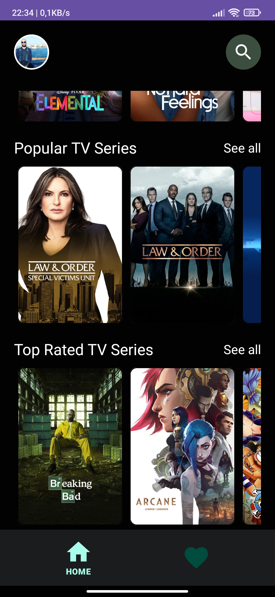

# MovieScope

The MovieScope App is an application where you can track trends of films and TV series, gain more information about them, and add your favorites to your list.

***API:***  https://developers.themoviedb.org/3/getting-started/introduction

# Libraries Used

+ MVVM
+ [Hilt](https://developer.android.com/jetpack/compose/libraries#hilt)
+ [Room](https://developer.android.com/training/data-storage/room)
+ [Navigation Component](https://developer.android.com/guide/navigation/navigation-getting-started)
+ [ViewModel](https://developer.android.com/topic/libraries/architecture/viewmodel#implement)
+ [Coroutines](https://developer.android.com/kotlin/coroutines)
+ [StateFlow, Flow](https://developer.android.com/kotlin/flow/stateflow-and-sharedflow#livedata)
+ [Repositories](https://developer.android.com/topic/architecture#data-layer)
+ [Paging 3](https://developer.android.com/topic/libraries/architecture/paging/v3-overview)
+ [Firebase Crashlytics](https://firebase.google.com/docs/crashlytics)
+ [Timber](https://github.com/JakeWharton/timber)
+ [Facebook Shimmer](https://github.com/facebookarchive/shimmer-android)
+ ***Third party libraries***
  - [Retrofit](https://square.github.io/retrofit/)
  - [OkHttp](https://square.github.io/okhttp/recipes/)
  - [Gson](https://github.com/google/gson)
  - [Glide](https://github.com/bumptech/glide)

# Output
| Home Screen | Home Screen | Favorites Screen | Favorites Screen | 
| --- | --- | --- | --- |
|  |  |   |  |

| Search Screen | SeeAll Screen | SeeAll Screen | Detail Screen | 
| --- | --- | --- | --- |
|  |  |  |  |

